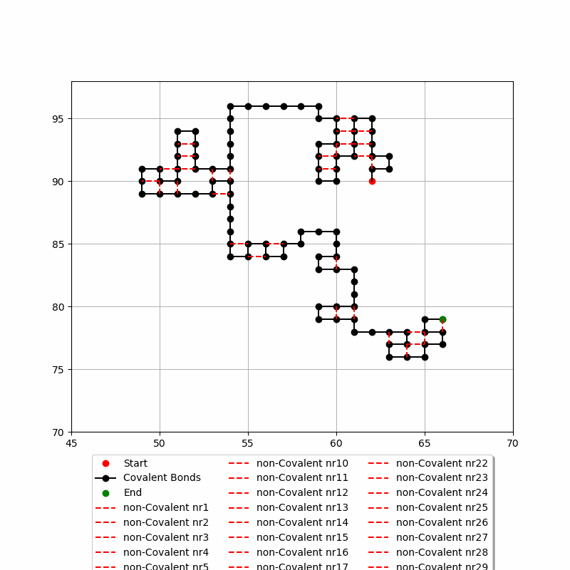

# Basic protein folding

This repository offers a straightforward object-oriented program for folding chains of monomers. It delivers fast results and can animate the results using a python program. 

## Contents

In this repository, you will find:
- Animations
- Pictures
- OOP strucre for folding
- Python code for animating all the nearest neighbor interactions

## Running the code
make the nessecary changes in src/main.c

```console
make
./main
```
the python scrtips needs to be run line by line

## Results


